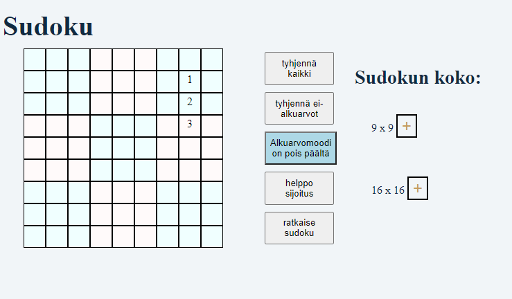

# sudokuJS

JavaScriptillä ohjelmoitu Sudoku-web-sovellus, jossa voi täytellä 9x9- tai 16x16-ruudukkoa. Virheet tulee tarkastettua automaattisesti,
ja "helppo sijoitus"-painiketta painamalla voi selvittää, onko omassa näössä vikaa vai pitääkö sudokun ratkaisemiseksi oikeasti pohtia asioita.
Ja toki laiskemmille on tarjolla ratkaisunappula.

Kehitettävää:
- alkuarvomoodin ollessa pois päältä alkuarvojen päälle voi kirjoittaa, mikä ei kai ole tarkoitus
- ratkaisu voisi reagoida, jos ratkaisua ei ole olemassa
- ulkonäkö (eli CSS:ää voisi joskus opetella)
